# 🚀 Kledo PHP API Demo

> **Panduan lengkap untuk mengintegrasikan aplikasi PHP kamu dengan API Kledo menggunakan Personal Access Token (PAT)**

Projek ini mendemonstrasikan cara mudah mengakses API Kledo untuk mengelola data akuntansi secara otomatis. Cocok untuk pemula yang ingin belajar integrasi API!

---

## ⚡ Simple Demo (Berbagai Bahasa)

Ingin mencoba API Kledo **tanpa instalasi Composer**? Di folder [`simple-demo/`](simple-demo/) tersedia contoh script minimal (~10–20 baris) dalam berbagai bahasa pemrograman:

| Bahasa | Lokasi | Perintah |
|--------|--------|----------|
| PHP | [simple-demo/php/](simple-demo/php/) | `php simple-demo.php` |
| Python | [simple-demo/python/](simple-demo/python/) | `python simple-demo.py` |
| JavaScript (Node.js) | [simple-demo/javascript/](simple-demo/javascript/) | `node simple-demo.js` |
| Go | [simple-demo/go/](simple-demo/go/) | `go run simple-demo.go` |
| Ruby | [simple-demo/ruby/](simple-demo/ruby/) | `ruby simple-demo.rb` |
| Rust | [simple-demo/rust/](simple-demo/rust/) | `cargo run` |
| Kotlin | [simple-demo/kotlin/](simple-demo/kotlin/) | `kotlinc ... && java -jar ...` |
| Perl | [simple-demo/perl/](simple-demo/perl/) | `perl simple-demo.pl` |
| Swift | [simple-demo/swift/](simple-demo/swift/) | `swift simple-demo.swift` |
| Dart | [simple-demo/dart/](simple-demo/dart/) | `dart run simple-demo.dart` |
| C# | [simple-demo/csharp/](simple-demo/csharp/) | `dotnet run` |
| Java | [simple-demo/java/](simple-demo/java/) | `javac SimpleDemo.java && java SimpleDemo` |
| Bash | [simple-demo/bash/](simple-demo/bash/) | `bash simple-demo.sh` |
| PowerShell | [simple-demo/powershell/](simple-demo/powershell/) | `pwsh simple-demo.ps1` |

**Cara pakai:** Edit `API_HOST` dan `ACCESS_TOKEN` di file yang dipilih, lalu jalankan perintah di atas. Detail lengkap lihat [simple-demo/README.md](simple-demo/README.md).

---

## 📋 Daftar Isi

- [Simple Demo (Berbagai Bahasa)](#-simple-demo-berbagai-bahasa)
- [Persiapan Awal](#-persiapan-awal)
- [Panduan Instalasi Tools](#-panduan-instalasi-tools)
  - [Windows](#windows)
  - [macOS](#macos)
  - [Linux (Ubuntu/Debian)](#linux-ubuntudebian)
- [Instalasi Project](#-instalasi-project)
- [Membuat API Key](#-membuat-api-key)
- [Konfigurasi](#-konfigurasi)
- [Menjalankan Aplikasi](#-menjalankan-aplikasi)
- [Troubleshooting](#-troubleshooting)

---

## 🛠 Persiapan Awal

Sebelum memulai, pastikan komputer kamu sudah terinstal tools berikut:

| Tools | Versi Minimum | Link Download | Kegunaan |
|-------|---------------|---------------|----------|
| **XAMPP** | 8.0+ | [Download XAMPP](https://www.apachefriends.org/download.html) | Web server lokal untuk menjalankan PHP |
| **Git** | Latest | [Download Git](https://git-scm.com/downloads) | Version control untuk clone project |
| **Composer** | Latest | [Download Composer](https://getcomposer.org/download/) | Package manager PHP |

> **💡 Tips untuk Pemula:**
> - XAMPP sudah include PHP, MySQL, dan Apache dalam satu paket
> - Install semua tools di atas secara berurutan
> - Restart komputer setelah instalasi selesai
> - **Belum install?** Lihat [Panduan Instalasi Tools](#-panduan-instalasi-tools) di bawah

---

## 🔧 Panduan Instalasi Tools

Pilih sistem operasi yang kamu gunakan:

### Windows

#### 1️⃣ Install XAMPP

1. Download **XAMPP** dari [apachefriends.org](https://www.apachefriends.org/download.html)
2. Pilih versi **PHP 8.0** atau lebih tinggi
3. Jalankan installer yang sudah di-download (contoh: `xampp-windows-x64-8.2.12-0-VS16-installer.exe`)
4. **Installer akan muncul:**
   - Klik **Next**
   - Pilih komponen (biarkan default, pastikan **Apache** dan **PHP** tercentang)
   - Pilih lokasi instalasi (disarankan: `C:\xampp`)
   - Klik **Next** → **Next** → **Finish**
5. Setelah selesai, buka **XAMPP Control Panel**
6. Klik **Start** pada **Apache** untuk testing
7. Buka browser, ketik `http://localhost` - jika muncul halaman XAMPP, berarti berhasil! ✅

#### 2️⃣ Install Git

1. Download **Git** dari [git-scm.com](https://git-scm.com/download/win)
2. Jalankan installer (contoh: `Git-2.43.0-64-bit.exe`)
3. **Ikuti wizard instalasi:**
   - Klik **Next**
   - Pilih lokasi instalasi (biarkan default)
   - Pilih komponen (biarkan default)
   - **Penting:** Pada "Adjusting your PATH environment", pilih **Git from the command line and also from 3rd-party software**
   - Pilih **Use bundled OpenSSH**
   - Pilih **Use the OpenSSL library**
   - **Line ending:** Pilih **Checkout Windows-style, commit Unix-style**
   - Terminal emulator: **Use MinTTY**
   - Klik **Next** → **Next** → **Install**
4. Setelah selesai, buka **Command Prompt** atau **PowerShell**
5. Ketik: `git --version`
6. Jika muncul versi Git (contoh: `git version 2.43.0`), berarti berhasil! ✅

#### 3️⃣ Install Composer

1. Download **Composer** dari [getcomposer.org](https://getcomposer.org/Composer-Setup.exe)
2. Jalankan `Composer-Setup.exe`
3. **Ikuti wizard instalasi:**
   - Klik **Next**
   - Installer akan mendeteksi PHP dari XAMPP
   - Jika tidak terdeteksi, browse manual ke: `C:\xampp\php\php.exe`
   - Klik **Next** → **Next** → **Install**
4. Setelah selesai, **restart Command Prompt**
5. Ketik: `composer --version`
6. Jika muncul versi Composer (contoh: `Composer version 2.6.5`), berarti berhasil! ✅

---

### macOS

#### 1️⃣ Install XAMPP

1. Download **XAMPP** dari [apachefriends.org](https://www.apachefriends.org/download.html)
2. Pilih versi **macOS** dengan PHP 8.0+
3. Buka file `.dmg` yang sudah di-download
4. Drag **XAMPP** ke folder **Applications**
5. Buka **Finder** → **Applications** → **XAMPP**
6. Klik kanan **manager-osx** → **Open**
7. Klik **Start** pada **Apache**
8. Buka browser, ketik `http://localhost` - jika muncul halaman XAMPP, berarti berhasil! ✅

> **⚠️ Catatan macOS:**
> - Jika ada peringatan security, buka **System Preferences** → **Security & Privacy** → Klik **Open Anyway**

#### 2️⃣ Install Git

**Cara 1 - Menggunakan Homebrew (Recommended):**
```bash
# Install Homebrew dulu (jika belum ada)
/bin/bash -c "$(curl -fsSL https://raw.githubusercontent.com/Homebrew/install/HEAD/install.sh)"

# Install Git
brew install git

# Cek versi
git --version
```

**Cara 2 - Download Manual:**
1. Download dari [git-scm.com/download/mac](https://git-scm.com/download/mac)
2. Buka file `.dmg`
3. Ikuti wizard instalasi
4. Verifikasi: buka Terminal, ketik `git --version`

#### 3️⃣ Install Composer

```bash
# Download Composer
php -r "copy('https://getcomposer.org/installer', 'composer-setup.php');"

# Verifikasi installer (optional)
php -r "if (hash_file('sha384', 'composer-setup.php') === 'dac665fdc30fdd8ec78b38b9800061b4150413ff2e3b6f88543c636f7cd84f6db9189d43a81e5503cda447da73c7e5b6') { echo 'Installer verified'; } else { echo 'Installer corrupt'; unlink('composer-setup.php'); } echo PHP_EOL;"

# Install Composer globally
php composer-setup.php --install-dir=/usr/local/bin --filename=composer

# Hapus installer
php -r "unlink('composer-setup.php');"

# Cek versi
composer --version
```

---

### Linux (Ubuntu/Debian)

#### 1️⃣ Install Apache, PHP, MySQL (Alternatif XAMPP)

Di Linux, lebih umum install komponen secara terpisah:

```bash
# Update package list
sudo apt update

# Install Apache
sudo apt install apache2 -y

# Install PHP 8.1 dan extensions
sudo apt install php8.1 php8.1-cli php8.1-common php8.1-mysql php8.1-zip php8.1-gd php8.1-mbstring php8.1-curl php8.1-xml -y

# Install MySQL (optional, jika perlu database)
sudo apt install mysql-server -y

# Start Apache
sudo systemctl start apache2
sudo systemctl enable apache2

# Cek di browser
# Buka: http://localhost
```

> **📝 Catatan:** Folder web root di Linux biasanya: `/var/www/html`

**Atau Install XAMPP (Jika Prefer GUI):**

```bash
# Download XAMPP Linux
wget https://sourceforge.net/projects/xampp/files/XAMPP%20Linux/8.2.12/xampp-linux-x64-8.2.12-0-installer.run

# Beri permission execute
chmod +x xampp-linux-x64-8.2.12-0-installer.run

# Jalankan installer
sudo ./xampp-linux-x64-8.2.12-0-installer.run

# Start XAMPP
sudo /opt/lampp/lampp start
```

#### 2️⃣ Install Git

```bash
# Install Git
sudo apt install git -y

# Cek versi
git --version

# Konfigurasi Git (optional tapi disarankan)
git config --global user.name "Nama Kamu"
git config --global user.email "email@example.com"
```

#### 3️⃣ Install Composer

```bash
# Install dependencies
sudo apt install curl php-cli php-mbstring unzip -y

# Download Composer
curl -sS https://getcomposer.org/installer -o composer-setup.php

# Install globally
sudo php composer-setup.php --install-dir=/usr/local/bin --filename=composer

# Hapus installer
rm composer-setup.php

# Cek versi
composer --version
```

---

## ✅ Verifikasi Instalasi

Setelah semua terinstall, verifikasi dengan command berikut:

**Windows (Command Prompt / PowerShell):**
```cmd
php --version
git --version
composer --version
```

**macOS / Linux (Terminal):**
```bash
php --version
git --version
composer --version
```

**Output yang diharapkan:**
```
PHP 8.1.x (cli) ...
git version 2.x.x
Composer version 2.x.x
```

Jika semua menampilkan versi dengan benar, kamu siap lanjut ke instalasi project! 🎉

---

## 📦 Instalasi Project

### Langkah 1: Clone Repository

Buka **Command Prompt** atau **Git Bash**, lalu jalankan perintah berikut:

```bash
# Masuk ke folder htdocs XAMPP (lokasi default)
cd C:\xampp\htdocs

# Clone project dari GitHub
git clone https://github.com/Kledo-ID/php-api-demo.git

# Masuk ke folder project
cd php-api-demo
```

> **📝 Catatan:** Jika folder XAMPP kamu berbeda, sesuaikan path-nya (contoh: `D:\xampp\htdocs`)

### Langkah 2: Install Dependencies

Jalankan perintah berikut untuk mengunduh semua library yang dibutuhkan:

```bash
composer install
```

**Tunggu hingga proses selesai** (biasanya 1-2 menit tergantung koneksi internet).

✅ **Berhasil!** Jika muncul pesan `Generating autoload files` berarti instalasi sukses.

---

## 🔑 Membuat API Key

API Key diperlukan agar aplikasi kamu bisa berkomunikasi dengan Kledo. Ikuti langkah-langkah berikut:

### Langkah 1: Daftar/Login ke Kledo

1. **Belum punya akun?** Daftar di [kledo.com/daftar](https://kledo.com/daftar/)
2. **Sudah punya akun?** Login di [app.kledo.com](https://app.kledo.com/)

### Langkah 2: Buat Personal Access Token

1. Setelah login, klik menu **Pengaturan**
2. Pilih **Integrasi** → **API Key**

   

3. Klik tombol **Tambah** (warna biru)

   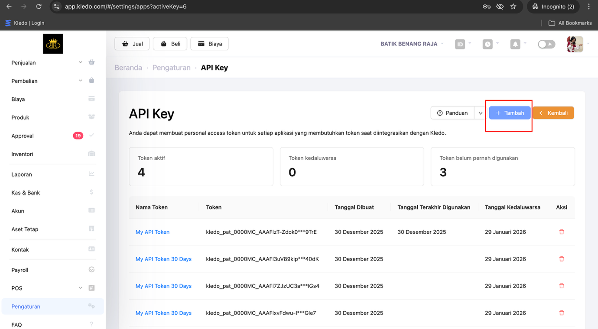

4. Isi form yang muncul:
   - **Nama Token**: Berikan nama yang mudah diingat (contoh: `Demo App` atau `Testing API`)

     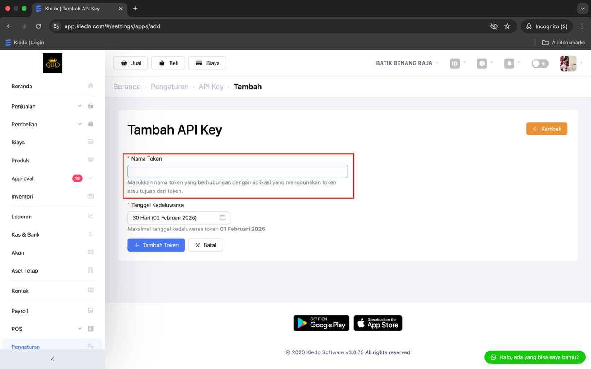

   - **Tanggal Kedaluwarsa**: Pilih tanggal kapan token ini akan expired (contoh: 1 bulan dari sekarang)

     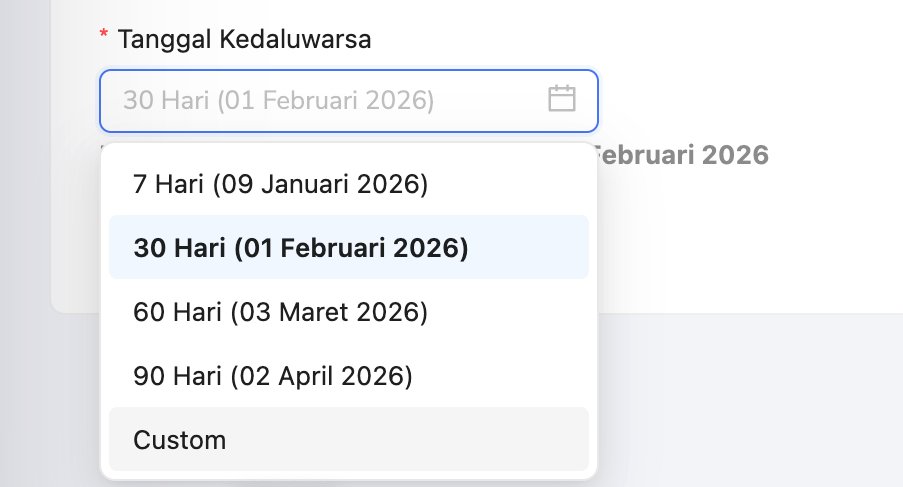

5. Klik tombol **Tambah Token**

   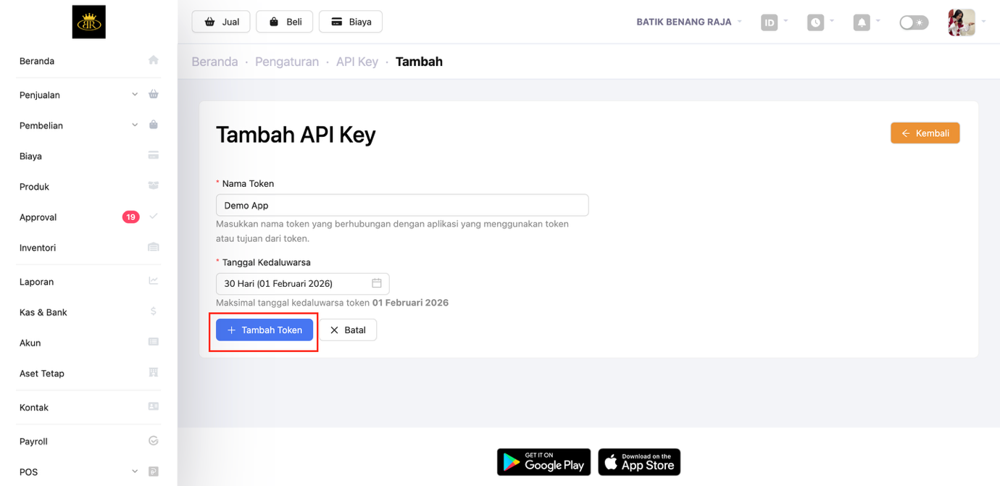

### Langkah 3: Simpan Token

⚠️ **PENTING!** Layar selanjutnya akan menampilkan **Personal Access Token** yang hanya muncul **SATU KALI**.

1. **Copy** token yang ditampilkan (contoh: `kledo_pat_0000MC_AACiJecQWjt6W...`)

   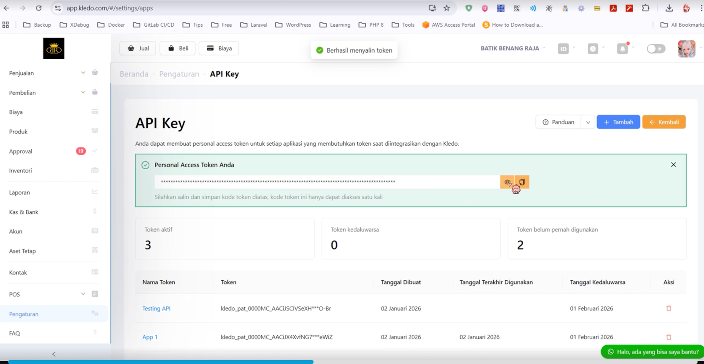

2. **Simpan** di Notepad atau text editor

   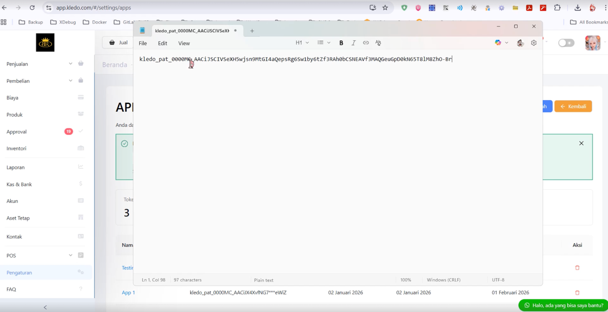

3. **Jangan hilangkan** token ini karena tidak bisa dilihat lagi setelah kamu menutup halaman

> **💡 Tips Keamanan:**
> - Jangan share token ke orang lain
> - Jangan commit token ke Git
> - Simpan di tempat yang aman

---

## ⚙️ Konfigurasi

### Langkah 1: Copy File Environment

Di folder project, kamu akan menemukan file `.env.example`. Rename file ini menjadi `.env`:

#### Cara 1 - Via Terminal/Command (Recommended) 💻

**Windows (Command Prompt / PowerShell):**
```cmd
# Pastikan kamu sudah di folder project
cd C:\xampp\htdocs\php-api-demo

# Copy file .env.example ke .env
copy .env.example .env
```

**macOS / Linux / Git Bash:**
```bash
# Pastikan kamu sudah di folder project
cd /Applications/XAMPP/htdocs/php-api-demo  # macOS
# atau
cd /var/www/html/php-api-demo              # Linux

# Copy file .env.example ke .env
cp .env.example .env
```

#### Cara 2 - Via File Explorer (Alternatif) 🖱️

**Windows:**
1. Buka folder `php-api-demo` di File Explorer
2. Klik kanan file `.env.example`
3. Pilih **Copy** → **Paste**
4. Rename hasil copy menjadi `.env`

**macOS:**
1. Buka Finder → folder `php-api-demo`
2. Klik kanan file `.env.example` → **Duplicate**
3. Rename hasil duplicate menjadi `.env`

**Linux:**
1. Buka File Manager → folder `php-api-demo`
2. Klik kanan file `.env.example` → **Copy**
3. Paste dan rename menjadi `.env`

---

### Langkah 2: Edit File .env

#### Template File .env

Sebelum edit, file `.env` akan terlihat seperti ini:

```text
API_HOST=http://xxx.api.kledo.com/api/v1
ACCESS_TOKEN="your_token_here"
```

#### Cara 1 - Edit via Terminal (Recommended) 💻

**Windows (Command Prompt / PowerShell):**
```cmd
# Gunakan Notepad bawaan Windows
notepad .env
```

Atau menggunakan text editor lain via command:
```cmd
# Jika sudah install VS Code
code .env

# Jika sudah install Notepad++
notepad++ .env
```

**macOS:**
```bash
# Gunakan nano (text editor terminal, user-friendly)
nano .env

# Atau gunakan vim (advanced)
vim .env

# Atau gunakan VS Code (jika sudah install)
code .env

# Atau gunakan TextEdit
open -a TextEdit .env
```

**Linux:**
```bash
# Gunakan nano (paling mudah untuk pemula)
nano .env

# Atau gunakan vim
vim .env

# Atau gunakan gedit (GUI)
gedit .env

# Atau gunakan VS Code (jika sudah install)
code .env
```

> **💡 Tips Nano Editor (macOS/Linux):**
> - Edit file seperti biasa
> - **Save:** Tekan `Ctrl + O`, lalu `Enter`
> - **Exit:** Tekan `Ctrl + X`

#### Cara 2 - Edit via GUI Editor (Alternatif) 🖱️

**Windows:**
- Klik kanan `.env` → **Open with** → Pilih:
  - Notepad (bawaan)
  - Notepad++ (jika sudah install)
  - VS Code (jika sudah install)

**macOS:**
- Klik kanan `.env` → **Open With** → Pilih:
  - TextEdit
  - VS Code
  - Sublime Text

**Linux:**
- Klik kanan `.env` → **Open With** → Pilih:
  - gedit
  - VS Code
  - Sublime Text
  - Vim/Nano (terminal)

---

### Langkah 3: Isi Konfigurasi

1. **Dapatkan API_HOST:**
   - Buka halaman Kledo → **Pengaturan** → **Integrasi** → **API Key**

     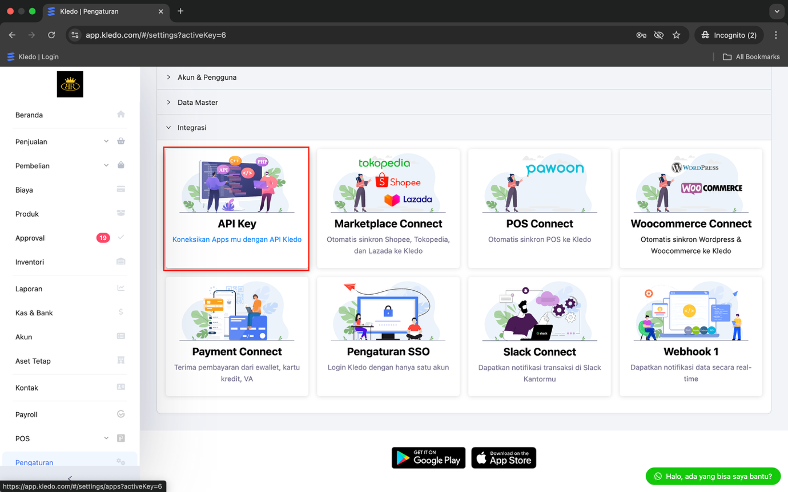

   - Copy **API Endpoint URL** yang ditampilkan (contoh: `http://abc123.api.kledo.com/api/v1`)

     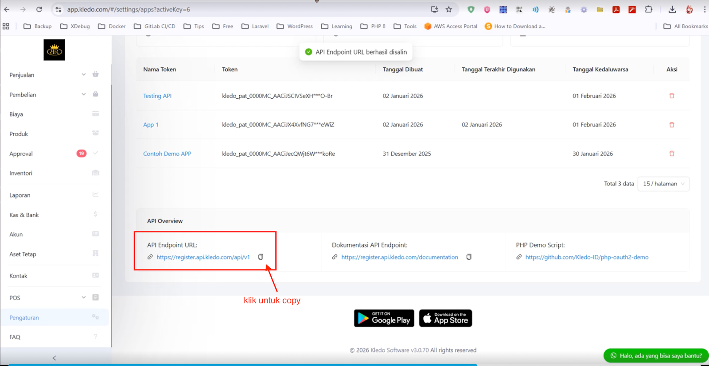

   - Paste ke `API_HOST`

     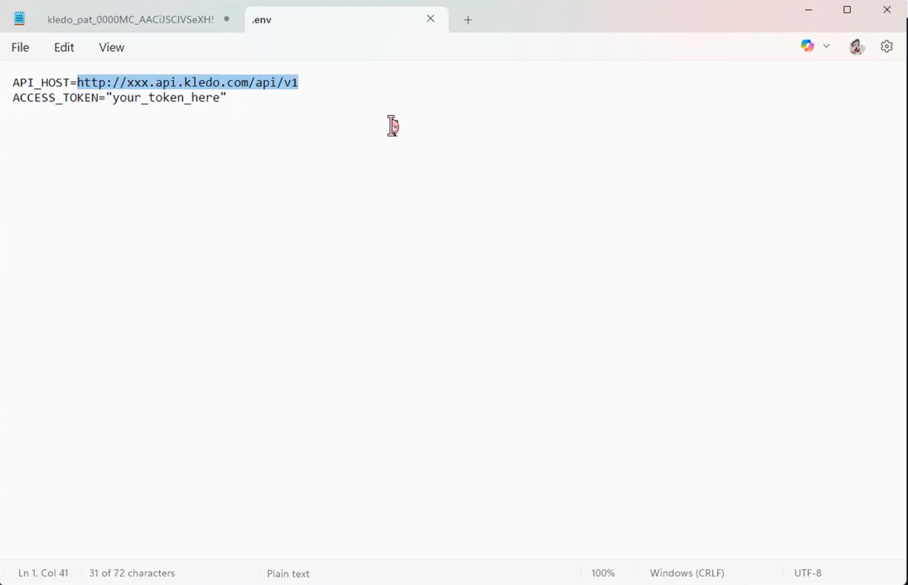

2. **Masukkan ACCESS_TOKEN:**
   - Paste **Personal Access Token** yang sudah kamu simpan sebelumnya
   - Pastikan token diapit tanda petik dua (`"`)

     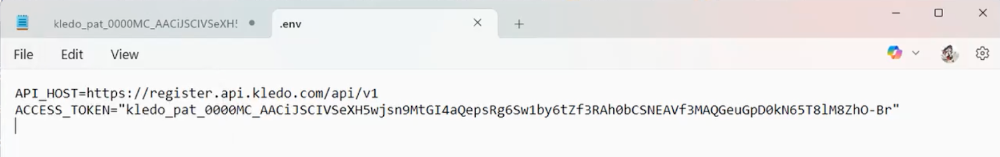

3. **Hasil akhir** akan terlihat seperti ini:

```text
API_HOST=http://abc123.api.kledo.com/api/v1
ACCESS_TOKEN="kledo_pat_0000MC_AACiJecQWjt6WkoRe"
```

4. **Save** file `.env`:
   - **Nano:** `Ctrl + O` → `Enter` → `Ctrl + X`
   - **Vim:** Tekan `Esc` → ketik `:wq` → `Enter`
   - **Notepad/GUI:** `Ctrl + S` atau **File** → **Save**

> **⚠️ Perhatian:**
> - Pastikan tidak ada spasi sebelum atau sesudah `=`
> - API_HOST tidak perlu tanda petik
> - ACCESS_TOKEN harus diapit tanda petik dua
> - File `.env` JANGAN di-commit ke Git (sudah ada di `.gitignore`)

---

## 🎯 Menjalankan Aplikasi

### Langkah 1: Start XAMPP

1. Buka **XAMPP Control Panel**
2. Klik tombol **Start** pada **Apache**
3. Tunggu hingga Apache berwarna hijau

### Langkah 2: Akses via Browser

Buka browser favorit kamu (Chrome, Firefox, Edge) dan ketik:

```
http://localhost/php-api-demo
```

atau

```
http://localhost/php-api-demo/index.php
```

### Langkah 3: Testing API

Aplikasi akan menampilkan halaman dengan beberapa contoh operasi CRUD untuk **Finance Account** (Akun Keuangan):

- ✅ **GET - Finance Account** - Menampilkan daftar akun keuangan
- ✅ **POST - Finance Account Create** - Membuat akun keuangan baru
- ✅ **GET - Finance Account Details** - Menampilkan detail akun keuangan tertentu
- ✅ **PUT - Finance Account** - Mengupdate akun keuangan
- ✅ **DELETE - Finance Account** - Menghapus akun keuangan

**Cara menggunakan:**

1. Klik pada setiap section untuk melihat contoh request dan response

   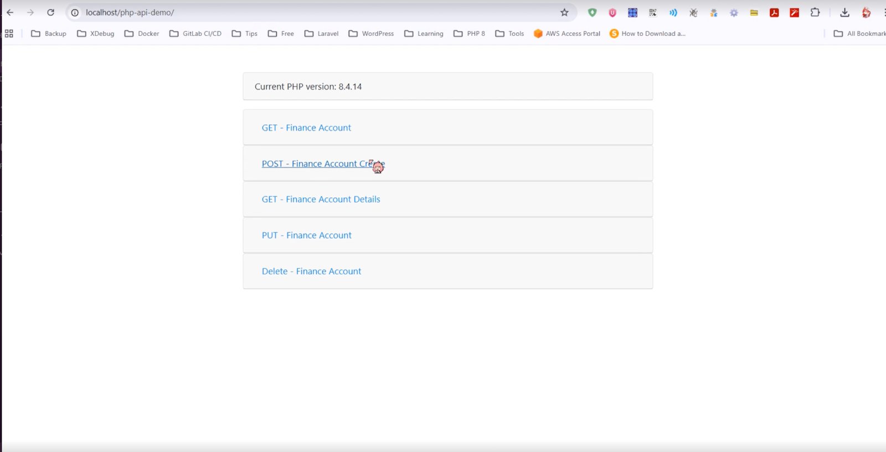

2. Klik tombol **Submit Request** untuk menjalankan API call secara langsung

   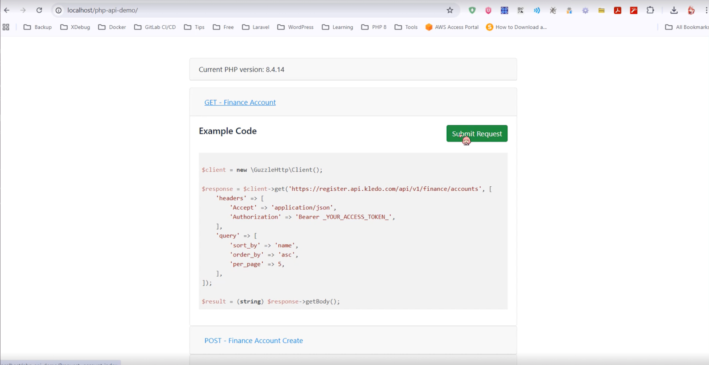

3. Response dari API akan ditampilkan di bawahnya

   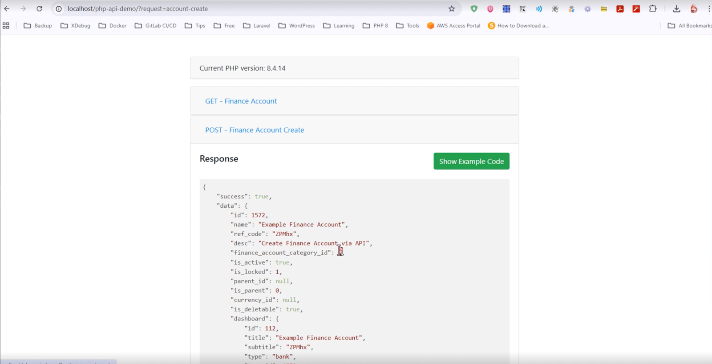

Jika semua berjalan lancar, kamu akan melihat data Finance Account dari akun Kledo kamu! 💰

---

## 🔧 Troubleshooting

### ❌ Error: "composer: command not found"

**Solusi:**
1. Pastikan Composer sudah terinstal dengan benar
2. Restart Command Prompt/Terminal
3. Coba jalankan: `composer --version`
4. Jika masih error, tambahkan Composer ke PATH environment variable

### ❌ Error: "Access denied" atau "Unauthorized"

**Solusi:**
1. Periksa kembali `ACCESS_TOKEN` di file `.env`
2. Pastikan token masih valid (belum expired)
3. Generate token baru di Kledo jika diperlukan

### ❌ Error: "API_HOST not found"

**Solusi:**
1. Cek file `.env` sudah dibuat (bukan `.env.example`)
2. Pastikan `API_HOST` sesuai dengan API Endpoint di halaman Kledo
3. Pastikan tidak ada typo atau spasi berlebih

### ❌ Apache di XAMPP tidak mau Start

**Solusi:**
1. Port 80 mungkin sudah dipakai aplikasi lain (Skype, IIS)
2. Buka **XAMPP Config** → **Apache (httpd.conf)**
3. Ubah port 80 menjadi 8080
4. Akses dengan `http://localhost:8080/php-api-demo`

### ❌ Halaman blank/kosong

**Solusi:**
1. Aktifkan **error reporting** di PHP
2. Cek file `error.log` di folder XAMPP
3. Pastikan semua extension PHP sudah aktif (curl, json, openssl)

### ❌ Error: "cURL error 60: SSL certificate problem"

**Error lengkap:**
```
cURL error 60: SSL certificate problem: unable to get local issuer certificate
```

Ini terjadi karena PHP tidak menemukan file CA Certificate untuk memverifikasi koneksi HTTPS.

**Solusi (Windows/XAMPP):**

#### Langkah 1: Download CA Certificate

```bash
# Buka browser dan download file ini:
# https://curl.se/ca/cacert.pem
# Atau gunakan PowerShell:

cd C:\xampp\php
Invoke-WebRequest -Uri https://curl.se/ca/cacert.pem -OutFile cacert.pem
```

Atau download manual:
1. Buka [https://curl.se/ca/cacert.pem](https://curl.se/ca/cacert.pem)
2. Save As → Simpan di `C:\xampp\php\cacert.pem`

#### Langkah 2: Edit php.ini

**Via Terminal:**
```cmd
# Buka php.ini dengan Notepad
notepad C:\xampp\php\php.ini
```

**Via GUI:**
1. Buka **XAMPP Control Panel**
2. Klik tombol **Config** di samping Apache
3. Pilih **PHP (php.ini)**

#### Langkah 3: Update Konfigurasi

Cari baris berikut (gunakan Ctrl+F):
```ini
;curl.cainfo =
```

Ubah menjadi (hapus `;` dan isi path):
```ini
curl.cainfo = "C:\xampp\php\cacert.pem"
```

Juga cari:
```ini
;openssl.cafile=
```

Ubah menjadi:
```ini
openssl.cafile="C:\xampp\php\cacert.pem"
```

#### Langkah 4: Restart Apache

1. Buka **XAMPP Control Panel**
2. Klik **Stop** pada Apache
3. Tunggu beberapa detik
4. Klik **Start** lagi

#### Langkah 5: Test

Refresh halaman aplikasi dan coba Submit Request lagi. Error seharusnya sudah hilang! ✅

**Solusi (macOS/Linux):**

Biasanya CA certificates sudah terinstall otomatis, tapi jika masih error:

**macOS:**
```bash
# Install CA certificates via Homebrew
brew install ca-certificates

# Update php.ini
sudo nano /Applications/XAMPP/etc/php.ini

# Tambahkan:
curl.cainfo = "/usr/local/etc/ca-certificates/cert.pem"
openssl.cafile = "/usr/local/etc/ca-certificates/cert.pem"
```

**Linux (Ubuntu/Debian):**
```bash
# Install CA certificates
sudo apt-get install ca-certificates -y

# Update php.ini
sudo nano /etc/php/8.1/apache2/php.ini

# Tambahkan:
curl.cainfo = "/etc/ssl/certs/ca-certificates.crt"
openssl.cafile = "/etc/ssl/certs/ca-certificates.crt"

# Restart Apache
sudo systemctl restart apache2
```

> **💡 Tips:**
> - Pastikan path file `cacert.pem` benar dan file ada
> - Gunakan forward slash `/` atau double backslash `\\` di Windows path
> - Restart Apache wajib setelah edit php.ini
> - Jika masih error, cek `phpinfo()` untuk memastikan konfigurasi ter-load

---

## 📚 Dokumentasi Lebih Lanjut

- 📖 [Dokumentasi API Kledo](https://api.kledo.com/documentation) - `api.kledo.com/documentation`
- 📧 Email Support: [hello@kledo.com](mailto:hello@kledo.com)

---

**Dibuat dengan ❤️ oleh Tim Kledo**
